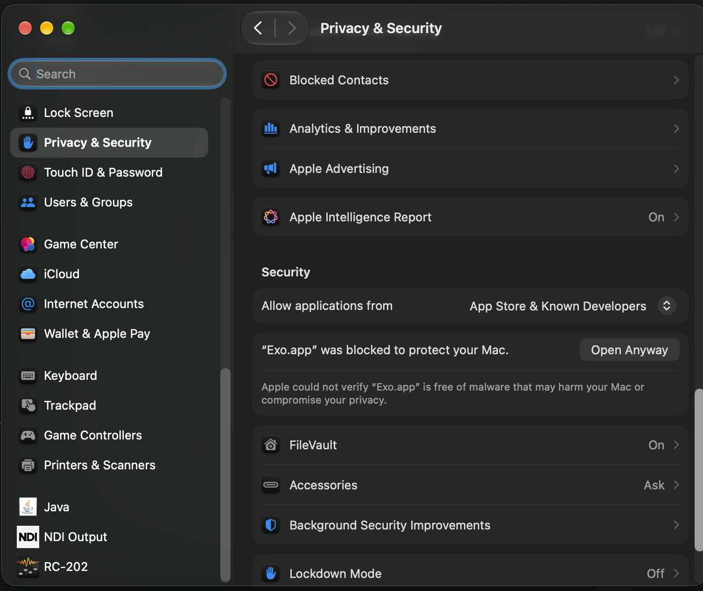
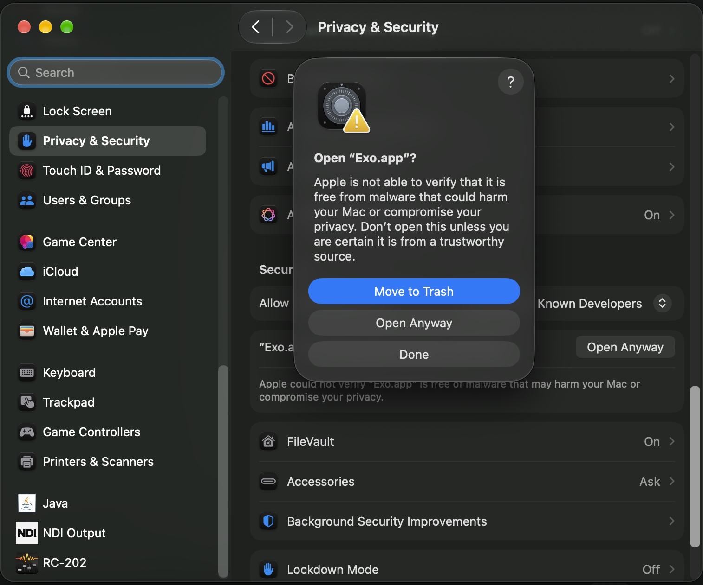

# Install Exo on your Mac

Exo isn't signed with an Apple Developer certificate yet. Because of that, macOS blocks it the first time you open it, and you have to allow it once in System Settings. After that it opens normally.

**Requirements:** a Mac with Apple silicon (M1 or newer).

## 1. Download

Download the latest `Exo_<version>_aarch64.dmg` from the [Exo releases page](https://github.com/TinyCloudLabs/tinychat/releases?q=exo-desktop&expanded=true). Pick the newest release that is **not** marked "Pre-release".

## 2. Install

1. Open the downloaded `.dmg`.
2. Drag **Exo** into the **Applications** folder.
3. Eject the Exo disk image.

## 3. Open it the first time

1. Open **Exo** from Applications.
2. macOS says Apple could not verify that "Exo.app" is free of malware. Click **Done**, not Move to Trash.
3. Open **System Settings → Privacy & Security** and scroll down to **Security**.
4. Next to *"Exo.app" was blocked to protect your Mac*, click **Open Anyway**.

   

5. In the dialog that appears, click **Open Anyway**. Then enter your Mac password or use Touch ID.

   

Exo now opens, and from then on it opens like any other app.

> The **Open Anyway** button only appears for about an hour after you try to open Exo. If you don't see it, open Exo again and go back to Privacy & Security.

## 4. Sign in

1. Click **Open app**, then **Sign in**.
2. Choose **Continue with email** or **Continue with Google**. Passkeys aren't available in this build.
3. For email, enter the 6-digit code from the email, then approve the permissions request.

## 5. Allow recording, if you use Local recording

The first time you start a **Local recording**, macOS asks for access to the **microphone** and to **system audio** (screen and system audio recording). Allow both. If you denied them by mistake, turn them on under **System Settings → Privacy & Security → Microphone** and **Screen & System Audio Recording**, then restart Exo.

## Updating

Download the new `.dmg` and drag Exo into Applications again, replacing the old one. macOS may ask you to repeat step 3 once for the new version.

## Alternative: Terminal

If you'd rather skip System Settings, run this once after step 2, then open Exo normally:

```sh
xattr -dr com.apple.quarantine /Applications/Exo.app
```
